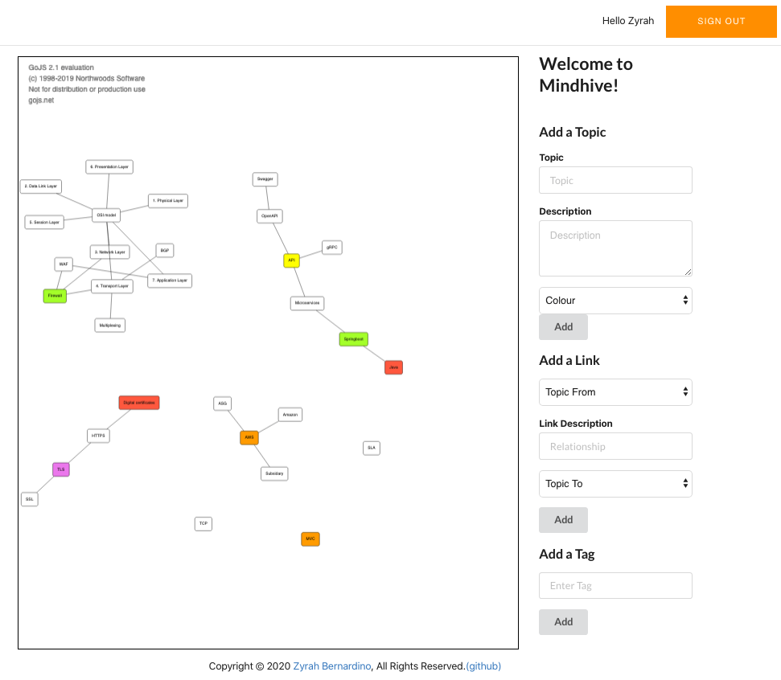

# MindHive

Inspo: I'm a visual learner and like to see how things are related. Couldn't 
find a mind mapping tool I liked so made one instead.
 
Tech stack: AWS Amplify, React, Graphql(DynamoDB/AppSync)

https://d1v0z5tmm8db3h.cloudfront.net

## TODO
- Diagram to update in place no reload
- Add TAG on UPDATE and ADD Topic 
- Filter on tag, for Vista view, with + filter on things
- Multiple TAGs on TOPIC
- Limit tags to 1 word lower case
- Update link, will be an addition to add
- Delete links
- Upload Image for topic
- Cache large search
- Search
- Use for ipad
- Study mode/Edit mode
- Click on topic, redirects instead of new page
- Fix up cognito so username doesn't have to Case Sensitive
- Add more colours and have it shown at the dropdown
- Cap characters for Description in Topic
- ~~Focus view, when adding a topic make it so the link is automatic to topic~~
- ~~Add a screenshot to the docs~~
- ~~Put my details at the bottom and also date~~
- ~~Delete topic and related links~~
- ~~Text box for Topic/description~~
- ~~Drop down for colour~~
- ~~Add TAG model to schema~~
- ~~Change tab icon~~

## Use
- `npm  start` will run on localhost:3000 (though will probs need to create your own amplify project :sweat_smile:)
- `amplify publish` update changes for running website

## Screenshot

## Lessons Learnt 

- When publishing with cloudfront and S3 make sure to clear the cloudfront cache if you keep getting `Unauthorised`.
It takes a couple of hours to get the cloudfront site working. Don't despair.
- Graphql queries make sure you add limits for listModel

### Ref

#### Links

- graph js lib:https://gojs.net/latest/index.html
- graphql schemas: https://aws-amplify.github.io/docs/cli-toolchain/graphql
- React ui: https://react.semantic-ui.com
- Amplify Auth: https://github.com/mwarger/amplify-auth-examples

#### Colours
- 5E36FF, bluepurple 

#### Icons

- logo: https://iconmonstr.com/idea-12-png/ 
